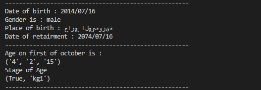

## Egyptian National Id information extractor
>Extract information from egyptian national id like date of birth , place of birth , gander and much more
[![NPM Version][npm-image]][npm-url]
[![Build Status][travis-image]][travis-url]
[![Downloads Stats][npm-downloads]][npm-url]



Can be used in government organizations and special organization who use egyptian national id

### Requirements

1. Python 3.5
2. dateutil
```sh
pip install python-dateutil
```
3. Setting UTF-8 to ON via Command Line
```sh
REM change CHCP to UTF-8
```
```sh
CHCP 65001
```

### Reference
https://ar.wikipedia.org/wiki/%D8%A8%D8%B7%D8%A7%D9%82%D8%A9_%D8%A7%D9%84%D8%B1%D9%82%D9%85_%D8%A7%D9%84%D9%82%D9%88%D9%85%D9%8A_%D8%A7%D9%84%D9%85%D8%B5%D8%B1%D9%8A%D8%A9


<!-- Markdown link & img dfn's -->
[npm-image]: https://img.shields.io/npm/v/datadog-metrics.svg?style=flat-square
[npm-url]: https://npmjs.org/package/datadog-metrics
[npm-downloads]: https://img.shields.io/npm/dm/datadog-metrics.svg?style=flat-square
[travis-image]: https://img.shields.io/travis/dbader/node-datadog-metrics/master.svg?style=flat-square
[travis-url]: https://travis-ci.org/dbader/node-datadog-metrics
[wiki]: https://github.com/yourname/yourproject/wiki


